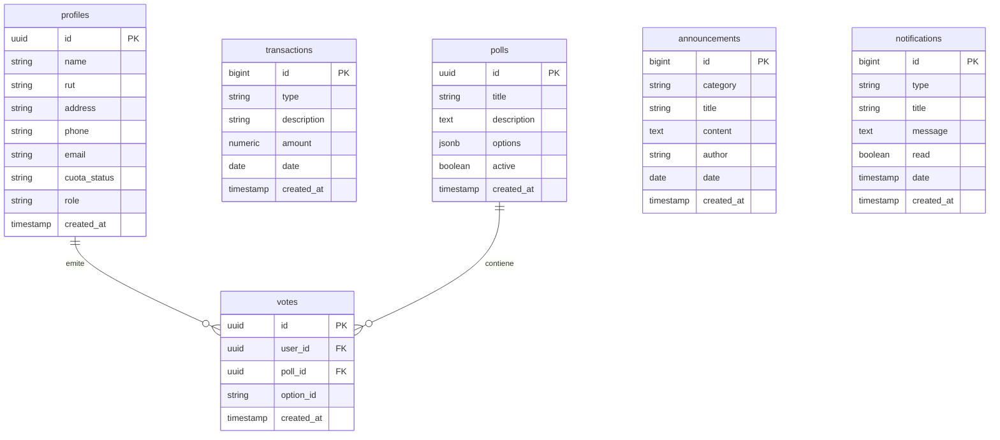

# Contexto de Backend y Base de Datos - JuntAPP

Este documento proporciona la especificacion detallada del backend de JuntAPP, desarrollado sobre la infraestructura de **Supabase (PostgreSQL)** y **Deno Edge Functions**. Describe el diseno de la base de datos, politicas de seguridad RLS, triggers de automatizacion, funciones de procesamiento de pagos y diagramas de flujo de datos (DFD).

---

## 1. Diagrama Entidad-Relacion (ERD)

El siguiente modelo relacional en la base de datos de Supabase garantiza el resguardo de la informacion, la trazabilidad de los pagos de cuotas y el anonimato del voto vecinal:



---

## 2. Especificacion de Tablas e Indices

### 2.1 Tabla: `public.profiles`
Almacena la informacion publica y el rol de los socios e integrantes de la junta de vecinos.

| Campo | Tipo | Restricciones | Descripcion |
|---|---|---|---|
| `id` | `uuid` | `PRIMARY KEY`, `REFERENCES auth.users` | Identificador unico ligado a la sesion del usuario. |
| `name` | `text` | `NOT NULL` | Nombre completo del vecino. |
| `rut` | `text` | `UNIQUE`, `NOT NULL` | RUN/RUT del usuario (formato limpio sin puntos ni guion para consultas). |
| `address` | `text` | `NOT NULL` | Direccion fisica dentro del limite territorial de la junta. |
| `phone` | `text` | `NULL` | Telefono de contacto. |
| `email` | `text` | `NOT NULL` | Correo electronico registrado. |
| `cuota_status` | `text` | `DEFAULT 'pendiente'` | Estado financiero (`'al_dia'` o `'pendiente'`). |
| `role` | `text` | `DEFAULT 'vecino'` | Privilegios del usuario (`'vecino'` o `'dirigente'`). |
| `created_at` | `timestamp` | `DEFAULT now()` | Fecha de creacion del perfil. |

* **Indices**:
  - `profiles_rut_idx` en `rut` (Hash/B-Tree) para busqueda veloz de RUTs.
  - `profiles_role_idx` en `role` para filtrado rapido de permisos.

### 2.2 Tabla: `public.transactions`
Registra los movimientos del libro de caja financiero de la junta de vecinos.

| Campo | Tipo | Restricciones | Descripcion |
|---|---|---|---|
| `id` | `bigint` | `PRIMARY KEY`, `GENERATED ALWAYS AS IDENTITY` | Identificador autoincremental de la transaccion. |
| `type` | `text` | `NOT NULL` | Tipo de movimiento (`'ingreso'` o `'egreso'`). |
| `description` | `text` | `NOT NULL` | Glosa o detalle explicativo del movimiento. |
| `amount` | `numeric` | `NOT NULL`, `> 0` | Monto en pesos chilenos (CLP). |
| `date` | `date` | `NOT NULL`, `DEFAULT current_date` | Fecha contable de ejecucion del movimiento. |
| `created_at` | `timestamp` | `DEFAULT now()` | Timestamp de insercion. |

### 2.3 Tabla: `public.polls`
Almacena las consultas ciudadanas barriales.

| Campo | Tipo | Restricciones | Descripcion |
|---|---|---|---|
| `id` | `uuid` | `PRIMARY KEY`, `DEFAULT gen_random_uuid()` | ID de la votacion. |
| `title` | `text` | `NOT NULL` | Pregunta o titulo de la votacion. |
| `description` | `text` | `NOT NULL` | Detalles, contexto o fecha limite explicada. |
| `options` | `jsonb` | `NOT NULL` | Estructura de alternativas en formato JSON Array: `[{"id": "opt-1", "text": "Camaras", "votes": 0}]`. |
| `active` | `boolean` | `DEFAULT true` | Determina si la votacion esta abierta para recepcion de votos. |
| `created_at` | `timestamp` | `DEFAULT now()` | Fecha de publicacion. |

### 2.4 Tabla: `public.votes`
Registra los votos emitidos por los vecinos. Mantiene una restriccion de unicidad para evitar la duplicidad del voto garantizando el anonimato.

| Campo | Tipo | Restricciones | Descripcion |
|---|---|---|---|
| `id` | `uuid` | `PRIMARY KEY`, `DEFAULT gen_random_uuid()` | ID de registro. |
| `user_id` | `uuid` | `REFERENCES public.profiles` | Vecino que emitio el voto. |
| `poll_id` | `uuid` | `REFERENCES public.polls` | Consulta en la que participa. |
| `option_id` | `text` | `NOT NULL` | Identificador de la opcion elegida (`'opt-1'`, `'opt-2'`, etc.). |
| `created_at` | `timestamp` | `DEFAULT now()` | Fecha y hora de emision. |

* **Restriccion Unica**: `UNIQUE(user_id, poll_id)` garantiza que un usuario solo pueda votar una vez por consulta.
* **Separacion de Anonimato**: Las consultas y recuentos de votos se calculan sumando sobre la tabla `votes`, pero el diseno de politicas RLS impide a cualquier usuario (incluso dirigentes) auditar que opcion voto un vecino en especifico, resguardando el voto secreto regulado por la Ley N°19.418.

### 2.5 Tabla: `public.announcements`
Comunicaciones de noticias oficiales emitidas por la directiva.

| Campo | Tipo | Restricciones | Descripcion |
|---|---|---|---|
| `id` | `bigint` | `PRIMARY KEY`, `GENERATED ALWAYS AS IDENTITY` | ID de publicacion. |
| `category` | `text` | `NOT NULL` | Tipo de comunicado (`'general'`, `'asamblea'`, `'beneficio'`, `'urgente'`). |
| `title` | `text` | `NOT NULL` | Titulo del comunicado. |
| `content` | `text` | `NOT NULL` | Cuerpo completo del mensaje. |
| `author` | `text` | `NOT NULL` | Remitente (Ej. "Directiva JuntAPP", "Comision Social"). |
| `date` | `date` | `DEFAULT current_date` | Fecha de publicacion. |
| `created_at` | `timestamp` | `DEFAULT now()` | Timestamp. |

---

## 3. Politicas RLS (Row Level Security)

Para garantizar el cumplimiento de la **Ley N°19.628 de proteccion de datos personales** y el resguardo de la privacidad de los vecinos, la base de datos opera bajo politicas de RLS estrictas:

```sql
ALTER TABLE public.profiles ENABLE ROW LEVEL SECURITY;
ALTER TABLE public.transactions ENABLE ROW LEVEL SECURITY;
ALTER TABLE public.polls ENABLE ROW LEVEL SECURITY;
ALTER TABLE public.votes ENABLE ROW LEVEL SECURITY;
ALTER TABLE public.announcements ENABLE ROW LEVEL SECURITY;
```

### 3.1 Politicas aplicadas por Tabla

* **`public.profiles`**:
  - *Lectura*: Los usuarios con rol `'dirigente'` pueden ver todos los perfiles (padron electoral completo). Los usuarios con rol `'vecino'` solo pueden consultar su propio registro (su ficha vecinal) y los perfiles de la directiva, impidiendo el acceso a correos y telefonos del resto de vecinos.
  - *Escritura*: Solo los `'dirigente'` pueden insertar o eliminar perfiles. Cualquier usuario puede actualizar sus propios datos de contacto (telefono y email).
* **`public.transactions`** (Libro de Caja):
  - *Lectura*: Todos los usuarios autenticados (Vecinos y Dirigentes) tienen acceso de lectura para asegurar la transparencia financiera total.
  - *Escritura*: Restringida exclusivamente a dirigentes (`role = 'dirigente'`).
* **`public.polls`** y **`public.announcements`**:
  - *Lectura*: Permiso publico para todos los usuarios autenticados.
  - *Escritura*: Restringida unicamente a administradores de la junta (`role = 'dirigente'`).
* **`public.votes`**:
  - *Insercion*: Cualquier vecino autenticado puede insertar un registro si es que la consulta correspondiente esta activa (`active = true`) y no ha votado antes.
  - *Lectura*: Los dirigentes y vecinos pueden consultar el total de votos agregados por alternativa, pero nadie puede ver la vinculacion individual de `user_id` con `option_id` de manera directa para evitar la coaccion del voto.

---

## 4. Triggers Contenidos en Base de Datos

### 4.1 Sincronizacion Automatizada de Registro (`handle_new_user`)
Para evitar discrepancias entre el sistema de autenticacion integrado de Supabase (`auth.users`) y la aplicacion logica (`public.profiles`), se ejecuta una funcion trigger al registrarse una nueva cuenta:

```sql
CREATE OR REPLACE FUNCTION public.handle_new_user()
RETURNS trigger AS $$
BEGIN
  INSERT INTO public.profiles (id, name, rut, address, phone, email, role, cuota_status)
  VALUES (
    new.id,
    coalesce(new.raw_user_meta_data->>'name', 'Vecino Nuevo'),
    coalesce(new.raw_user_meta_data->>'rut', ''),
    coalesce(new.raw_user_meta_data->>'address', 'Sin Direccion'),
    new.raw_user_meta_data->>'phone',
    new.email,
    coalesce(new.raw_user_meta_data->>'role', 'vecino'),
    'pendiente'
  );
  RETURN new;
END;
$$ LANGUAGE plpgsql SECURITY DEFINER;

CREATE TRIGGER on_auth_user_created
  AFTER INSERT ON auth.users
  FOR EACH ROW EXECUTE FUNCTION public.handle_new_user();
```

---

## 5. Deno Edge Functions

### 5.1 `create-payment` (Edge Function)
Encargada de iniciar el cobro de la cuota social de forma segura:
- Recibe el `socioId`, el monto (CLP) y el concepto del pago.
- Valida la existencia del perfil en la base de datos de Supabase.
- Genera un identificador de transaccion unico pre-fijado en la base de datos como `PENDIENTE: [Concepto]`.
- Retorna la URL de redireccion simulada de Webpay/Flow hacia el cliente.

### 5.2 `payment-webhook` (Edge Function)
Callback seguro que procesa la respuesta de la pasarela de pago:
- Escucha peticiones POST provenientes de la pasarela (Webpay/Flow).
- Decodifica y valida la firma de la transaccion.
- Al confirmarse el estado aprobado (`'approved'`):
  1. Actualiza el valor de `cuota_status` a `'al_dia'` en el perfil del socio correspondiente.
  2. Registra de forma definitiva el ingreso en la tabla `transactions` (removiendo el prefijo `PENDIENTE` de la glosa contable).
  3. Inserta una notificacion del sistema dirigida al usuario para confirmarle el abono.

---

## 6. Diagramas de Flujo de Datos (DFD)

### 6.1 DFD: Proceso de Pago de Cuotas y Conciliacion Contable

El siguiente diagrama detalla la interaccion de datos entre el Vecino, el Frontend, la Edge Function de Supabase, la Pasarela Externa y la base de datos PostgreSQL:

```mermaid
sequenceDiagram
    actor Vecino
    participant FE as Cliente Frontend
    participant EF as Edge Function (create/webhook)
    participant GW as Pasarela Webpay/Flow
    database DB as Supabase PostgreSQL

    Vecino->>FE: Presiona "Pagar Cuota con Webpay"
    FE->>EF: POST /v1/create-payment (socioId, amount)
    EF->>DB: Registra transaccion temporaria ("PENDIENTE: Pago Cuota")
    EF-->>FE: Retorna URL de Transaccion Segura
    FE->>GW: Redirige al portal de pago externo
    Vecino->>GW: Completa transaccion bancaria (Simulada/Real)
    GW->>EF: POST /v1/payment-webhook (txId, status: approved)
    EF->>DB: UPDATE profiles SET cuota_status = 'al_dia'
    EF->>DB: UPDATE transactions SET desc = 'Pago Cuota Aprobado'
    EF->>DB: INSERT INTO notifications (Aviso de pago exitoso)
    GW-->>FE: Redireccion de retorno al comercio
    FE->>DB: Solicita recuento actualizado
    DB-->>FE: Retorna nuevos balances y estado
    FE-->>Vecino: Muestra Comprobante JV-Receipt y actualiza graficos
```

### 6.2 DFD: Proceso de Emision de Voto Seguro y Anonimato

Este flujo detalla la validacion del quorum y la insercion de la decision democratica previniendo la duplicacion del voto:

```mermaid
sequenceDiagram
    actor Vecino
    participant FE as Cliente Frontend
    database DB as Supabase PostgreSQL

    Vecino->>FE: Selecciona alternativa y presiona "Confirmar Voto"
    FE->>DB: SELECT * FROM votes WHERE user_id = USER_ID AND poll_id = POLL_ID
    DB-->>FE: Retorna si existe registro previo (Unicidad)
    alt Ya ha votado
        FE-->>Vecino: Alerta "Ya has emitido tu voto en esta consulta" (Aborta)
    else No ha votado
        FE->>DB: INSERT INTO votes (user_id, poll_id, option_id)
        note over DB: Restriccion UNIQUE previene colisiones concurrentes
        DB-->>FE: Confirmacion de insercion exitosa
        FE->>DB: Ejecuta recuento anonimo agrupado por option_id
        DB-->>FE: Retorna porcentajes consolidados de la consulta
        FE-->>Vecino: Oculta formulario, muestra alerta de exito y barra de resultados
    end
```
