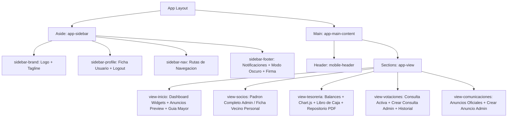

# Contexto del Frontend y Arquitectura del Cliente - JuntAPP

Este documento proporciona la especificacion detallada del cliente frontend de JuntAPP. Describe la arquitectura del lado del cliente, el sistema de rutas, la maquetacion responsiva, las hojas de estilo basadas en variables CSS personalizadas (Design Tokens) y las responsabilidades de cada modulo JavaScript en la aplicacion.

---

## 1. Estructura de Componentes e Interfaz

El diseno modular de la interfaz de JuntAPP organiza la pantalla en un diseno de dos paneles principales en escritorio, y una cabecera movil con un dock de navegacion flotante en pantallas tactiles:

---

## 2. Sistema de Diseno Visual (Design Tokens CSS)

JuntAPP esta disenado bajo las directrices del manual de normas graficas del gobierno de Chile, combinando un color azul institucional con acentos rojos calidos para transmitir confianza y seriedad, manteniendo una alta accesibilidad.

### 2.1 Colores y Variables de Tema (`style.css`)
El archivo [style.css](file:///c:/Users/lucas/Downloads/ProyectosInteresantes/JuntAPP/frontend/src/css/style.css) utiliza variables nativas de CSS (`:root`) para controlar los estilos generales y facilitar el soporte automatico de **Modo Oscuro**:

* **Paleta Primaria e Institucional**:
  - `--primary`: `hsl(215, 60%, 16%)` (Azul Armada de Confianza).
  - `--accent`: `hsl(354, 70%, 46%)` (Rojo Carmesi Calido Chileno).
  - `--success`: `hsl(145, 63%, 42%)` (Verde Esmeralda para ingresos y pagos aprobados).
* **Fondos y Bordes (Modo Claro)**:
  - `--bg`: `hsl(30, 18%, 96%)` (Blanco Hueso Suave para reducir la fatiga visual).
  - `--bg-card`: `hsl(0, 0%, 100%)` (Blanco Puro para tarjetas).
  - `--border`: `hsl(30, 10%, 89%)` (Gris Calido muy sutil).
* **Variables del Modo Oscuro (`[data-theme="dark"]`)**:
  - `--bg`: `hsl(220, 25%, 9%)` (Pizarra Oscuro).
  - `--bg-card`: `hsl(220, 25%, 13%)` (Gris carbon para contraste).
  - `--text`: `hsl(220, 20%, 93%)` (Blanco suave para evitar encandilamiento).

### 2.2 Accesibilidad (Ley de Inclusion y Tercera Edad)
- **Tipografia**: Se usan las fuentes **Outfit** (para titulos con presencia) e **Inter** (para textos de lectura con espaciado amplio).
- **Indicador de Foco**: Configuracion explicita de `*:focus-visible` aplicando un contorno azul brillante de `3px` para navegacion asistida mediante teclado (cumplimiento WCAG/Vercel).
- **Saltador de Contenido**: Enlace `.skip-link` al inicio del body para saltar la navegacion del sidebar e ir directo al contenido principal en lectores de pantalla.
- **Tamano de Botones**: Todos los inputs y botones de accion interactivos tienen una altura minima de `52px` en dispositivos moviles para asegurar una facil pulsacion tactil.

---

## 3. Enrutamiento del Lado del Cliente (`router.js`)

El enrutamiento de JuntAPP es ligero, basado en el cambio de hash del navegador (`window.location.hash`). 

* **Flujo del Enrutador**:
  1. Captura el evento `hashchange` en la ventana.
  2. Lee el token de la URL (por ejemplo, `#tesoreria`).
  3. Busca el elemento HTML `<section class="app-view" id="view-[hash]">`.
  4. Remueve la clase `.active` de todas las secciones e incorpora la clase `.active` en la vista seleccionada.
  5. Sincroniza la clase `.active` en el menu de navegacion del sidebar.
  6. Dispara la ejecucion del modulo JS correspondiente (Ej. `tesoreriaModule.render()`) para actualizar los datos en tiempo real de forma asincrona.

---

## 4. Modulos JavaScript y Responsabilidades (`src/js/`)

### 4.1 Modulo de Autenticacion (`modules/auth.js`)
- Gestiona el estado de sesion del usuario activo interactuando con `db.js`.
- Controla el despliegue del panel de inicio de sesion y registro (`#authOverlay`).
- Valida en tiempo real el RUT chileno mediante el algoritmo Modulo 11, aplicando formateo visual automatico (`XX.XXX.XXX-X`) al escribir y notificando en rojo si el digito verificador es incorrecto.
- Configura los elementos del perfil en el sidebar (avatar, RUT, nombre, y boton para cerrar sesion).

### 4.2 Modulo de Dashboard Principal (`modules/dashboard.js`)
- Calcula y formatea la caja disponible actual y el total de socios al dia.
- Muestra el estado actual de participacion del usuario en la encuesta activa.
- Renderiza una vista previa condensada de los ultimos 2 comunicados oficiales.
- Administra un estado vacio (empty state) visual si no se encuentran noticias.

### 4.3 Modulo de Socios e Inclusividad (`modules/socios.js`)
Implementa una estricta **segregacion de privilegios** en la interfaz:
* **Vista Vecino (Socio)**: Oculta el buscador y listado completo del padron para cumplir con el resguardo de privacidad. Muestra dos tarjetas:
  1. *Mis Datos de Socio*: Permite al usuario revisar sus datos actuales y actualizar directamente su correo y telefono mediante un formulario interactivo.
  2. *Contacto de Directiva*: Proporciona los accesos directos por WhatsApp o Email de la Presidenta, Secretario y Tesorero vigentes.
* **Vista Dirigente (Administrador)**: Permite visualizar el padron de socios completo. Habilita una barra de busqueda dinamica multi-criterio, un boton de eliminacion de vecinos, un trigger para cambiar el estado de pago del socio en un clic y el boton para abrir el formulario de inscripcion de nuevos socios.

### 4.4 Modulo de Tesoreria Transparente (`modules/tesoreria.js`)
- Integra **Chart.js** para graficar los datos contables:
  - *Doughnut Chart*: Clasifica dinamicamente los egresos mensuales en categorias leyendo las descripciones.
  - *Bar Chart*: Grafico comparativo de barras mensuales mostrando ingresos contra egresos historicos.
- Renderiza el libro de caja con orden cronologico inverso.
- Actualiza el widget de avance financiero de cuotas sociales cobradas.
- Administra la seccion "Repositorio de Transparencia":
  - Muestra un listado dinamico de documentos oficiales (PDF) en el bucket.
  - Si es administrador (Dirigente), renderiza los triggers para subir documentos en PDF (limite 5MB) y botones para borrar archivos.

### 4.5 Modulo de Votaciones Digitales (`modules/votaciones.js`)
- Carga y renderiza la consulta barrial abierta (votos secretos y validacion de participacion).
- Si el usuario no ha votado, muestra las opciones como radio buttons de gran tamano. Al presionar "Confirmar Voto", ejecuta la llamada asincrona y bloquea la UI.
- Si el usuario ya participo, esconde el formulario de votacion y dibuja graficos de barras horizontales con el porcentaje de los resultados parciales en tiempo real.
- Renderiza el historial de elecciones pasadas y los nombres de las propuestas ganadoras.
- Maneja el modal de creacion de nuevas consultas (`#addPollModal`) para dirigentes, desactivando consultas anteriores en base de datos al enviar.

### 4.6 Modulo de Notificaciones y Push SW (`modules/notifications.js`)
- Solicita permisos de notificaciones al usuario.
- Registra el Service Worker de la aplicacion (`sw.js`).
- Administra el panel de notificaciones desplegable y el indicador de burbuja roja (badge) con el conteo de notificaciones sin leer.

---

## 5. Service Worker (`public/sw.js`)

El archivo [sw.js](file:///c:/Users/lucas/Downloads/ProyectosInteresantes/JuntAPP/frontend/public/sw.js) corre en segundo plano en el navegador de los vecinos:
- **Evento `push`**: Escucha payloads emitidos por el servidor de Supabase Edge Functions. Parsea los campos `title`, `body` e `icon`, desplegando notificaciones nativas en el sistema operativo del computador o celular.
- **Acciones Nativas**: Incluye soporte para botones interactivos en la alerta (por ejemplo: un boton `"Pagar Cuota"` que al pulsarse redirige de forma directa al modulo de tesoreria).
- **Evento `notificationclick`**: Al hacer clic en la alerta, el Service Worker busca si existe una ventana del navegador abierta de JuntAPP, la enfoca y navega al fragmento de ruta adecuado para responder a la notificacion.
